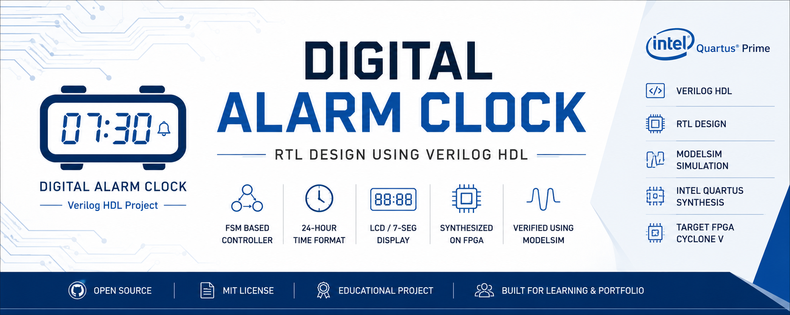

  

# ⏰ Digital Alarm Clock (Verilog HDL)

## Overview
## 🏗️ Project Architecture

## Features

## Architecture

## FSM Design

## Project Structure

## Simulation

## RTL Synthesis

## Results

## Tools Used

## Future Improvements

## Author
